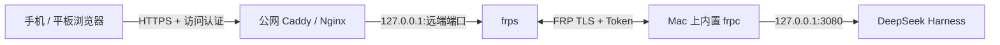

# dsh-desktop

<p align="center">
  <strong>简体中文</strong> · <a href="README_EN.md">English</a>
</p>

<p align="center">
  
</p>

<p align="center">
  DeepSeek Harness 的原生 macOS 桌面包装器。提供独立窗口、运行时自举、插件管理、桌面宠物、代码侧栏，以及面向手机和平板的 FRP 远程访问。
</p>

<p align="center">
  <a href="https://github.com/sunkeycn/dsh-desktop/releases/latest">下载最新版</a>
  ·
  <a href="#手机远程访问">手机远程访问</a>
  ·
  <a href="#从源码构建">从源码构建</a>
  ·
  <a href="#安全说明">安全说明</a>
</p>


## 功能

- 原生 macOS 窗口：使用 AppKit + WKWebView，保留系统窗口按钮并采用沉浸式透明标题栏。
- 自动准备运行环境：首次启动下载 Node.js 和 `@deepseek-ai/dsh`，后续可在 App 内检查 Harness 更新。
- 原生插件管理：查看版本、升级、启用、禁用和移除插件，多项修改可统一重启生效。
- 内置代码侧栏：使用开源的 [`dsh-better-sidebar`](https://github.com/omdsh-dev/DSH-better-sidebar)。
- 内置桌面宠物：使用 [`dsh-pet`](https://github.com/PC2005-cloud/dsh-pet)，同时提供 VP9-alpha WebM 和 HEVC-alpha MOV，在 Chromium 与 WKWebView 中均可透明显示。
- 内置 FRP 客户端：安装包自带 `frpc 0.71.0` 和配置插件，可将本机 DSH 安全转发到自建 `frps`，通过手机、平板等移动设备的浏览器远程访问。
- 本地数据优先：FRP Token 保存到 macOS Keychain，网页端无法读取已保存的 Token。

## 界面预览

### 插件管理


### 远程访问


### Harness 更新


### 启动状态


> 截图中的插件版本可能高于安装包内置版本，因为插件管理器支持独立升级。

## 安装

1. 从 [Releases](https://github.com/sunkeycn/dsh-desktop/releases/latest) 下载与你的 Mac 架构匹配的 DMG。
2. 打开 DMG，将 `DeepSeek Harness.app` 拖入“应用程序”。
3. 首次启动等待 App 自动准备 Node.js、Harness 和内置插件。

当前发布的 DMG 使用 ad-hoc 签名，没有 Apple Developer ID 公证。macOS 若阻止首次打开，请在“系统设置 → 隐私与安全性”中确认打开，或从源码自行构建。

### 系统要求

- macOS 12.0 或更高版本
- 可访问 npm、GitHub Releases 和 Node.js 下载站点的网络
- 当前 Release 标注其构建架构；本项目不会把单架构产物标记为 Universal

## 内置插件

| 插件 | 内置版本 | 用途 | 来源 |
| --- | --- | --- | --- |
| `dsh-pet` | `0.1.8` | 桌面宠物 | [PC2005-cloud/dsh-pet](https://github.com/PC2005-cloud/dsh-pet) |
| `dsh-better-sidebar` | `0.15.2` | 代码与工作区侧栏 | [omdsh-dev/DSH-better-sidebar](https://github.com/omdsh-dev/DSH-better-sidebar) |
| `dsh-frp-remote` | `0.2.0` | FRP 配置与隧道管理 | 本仓库 |

内置版本只用于首次安装和缺失修复。安装后可以通过“DeepSeek Harness → 插件管理…”独立检查更新。

## FRP 远程访问

dsh-desktop 内置 `frpc 0.71.0` 和 `dsh-frp-remote` 插件，不需要在 Mac 上另外安装 FRP 客户端。它会把固定监听在 `127.0.0.1:3080` 的 DSH Web 服务，通过加密的 FRP 隧道转发到你自己的公网服务器。



### 已内置的能力

- `frpc 0.71.0`：随 App 安装到本地运行时，由插件负责启动和重启。
- 图形化配置：在 DSH 设置页的“远程访问”中配置 Server、TLS、Token、代理名称、远端端口和公网 HTTPS 地址。
- 固定本地目标：只允许转发 `127.0.0.1:3080`，网页不能修改成本机其他服务。
- 凭据保护：FRP Token 存放于 macOS Keychain，不写入 TOML，也不会返回给网页客户端。
- 本机管理边界：配置 API 只监听 `127.0.0.1:3081`，写操作还需要可信 Origin 和 CSRF Token；手机等远程设备不能修改 FRP 配置。
- Trusted Host：App 会读取公网 HTTPS 地址，并在启动 Harness 时自动加入对应的 `--trusted-host`。

### 需要自行准备

- 一台有公网地址的服务器，并在服务器上运行 [`frps`](https://github.com/fatedier/frp)。
- 一个指向该服务器的域名，以及 Caddy、Nginx 等 HTTPS 反向代理。
- 公网访问认证，例如 Basic Auth、OAuth/OIDC 网关或 VPN。FRP 本身不提供网页登录保护。

## 手机远程访问

以下示例使用 `frps.example.com:7000` 作为 FRP Server、`13080` 作为远端端口、`https://dsh.example.com` 作为手机访问地址。请替换为自己的域名、端口和高强度随机 Token。

### 1. 在公网服务器部署 frps

下载与服务器架构匹配的 [frp Release](https://github.com/fatedier/frp/releases)，创建 `frps.toml`：

```toml
bindPort = 7000

auth.method = "token"
auth.token = "replace-with-a-strong-random-token"
```

启动 `frps`，并允许 Mac 连接服务器的 TCP `7000` 端口。生产环境建议使用 systemd 或容器保证服务自动重启。

### 2. 配置 HTTPS 与访问认证

在公网服务器上把域名反向代理到 FRP 的远端端口。以下是 Caddy 示例：

```caddyfile
dsh.example.com {
    basic_auth {
        dsh-user <HASH_FROM_CADDY_HASH_PASSWORD>
    }
    reverse_proxy 127.0.0.1:13080
}
```

使用 `caddy hash-password` 生成密码哈希。防火墙应阻止公网直接访问 `13080`，否则访问者可以绕过 HTTPS 和认证直接进入 DSH。

### 3. 在 Mac 上配置隧道

打开 DeepSeek Harness，在“设置 → 远程访问”中填写：

| 配置项 | 示例值 |
| --- | --- |
| 启用隧道 | 开启 |
| 服务器地址 | `frps.example.com` |
| 服务器端口 | `7000` |
| TLS | 开启 |
| 鉴权方式 | Token |
| Token | 与 `frps.toml` 保持一致 |
| 代理名称 | `dsh-web` |
| 本地服务 | `127.0.0.1:3080`（固定、只读） |
| 远端端口 | `13080` |
| 公网 HTTPS 地址 | `https://dsh.example.com` |

先点击“测试连接”，确认 FRP Server 可达，再点击“保存并重启隧道”。如果修改了公网 HTTPS 地址，还需要重新启动 Harness，使新的 Trusted Host 生效。

### 4. 从手机或平板访问

确保 Mac 没有休眠、Harness 正在运行且隧道状态显示“已连接”，然后在 iPhone、iPad 或 Android 设备的浏览器中打开 `https://dsh.example.com`，通过公网入口的访问认证后即可使用当前 Mac 上的 DSH。

移动设备只需要现代浏览器，不需要安装 FRP 客户端。远程访问依赖 Mac、公网服务器和网络连接持续在线。

### 配置字段

DSH 设置页中的“远程访问”支持配置：

- FRP Server 地址和端口
- TLS 开关
- Token 鉴权
- 代理名称和远端端口
- 公网 HTTPS 地址

本地服务固定为 `127.0.0.1:3080`。配置文件位于 `~/.dsh/frp`，Token 存放于 macOS Keychain；本地配置 API 仅监听 `127.0.0.1:3081`，写操作需要可信 Origin 和 CSRF 令牌。

## 安全说明

- FRP 只提供网络隧道，不提供公网 HTTPS、登录认证或访问控制。
- 将 DSH 暴露到公网前，必须在入口层配置 HTTPS 和可靠的访问认证。
- 使用防火墙限制 FRP 远端端口，避免绕过反向代理的 HTTPS 和认证。
- 使用高强度随机 FRP Token，并及时更新 `frps`、反向代理和 dsh-desktop。
- 不要把 FRP Token、私钥、Cookie 或其他凭据提交到仓库、Issue 或日志中。
- 远程页面只能读取脱敏状态，不能读取或修改本机保存的 FRP Token。
- 插件会在本机 Harness 进程中运行，只安装你信任的插件和版本。

## 从源码构建

### 依赖

- macOS 12+
- Xcode Command Line Tools（Swift、codesign、iconutil）
- Node.js / npm
- `ffmpeg`（生成宠物 HEVC-alpha 资源）

### 构建命令

```bash
./build.sh
./build.sh --install
./build.sh --dmg
./build.sh --version 1.0.0 --install --dmg
```

构建脚本会：

1. 编译 Swift App。
2. 从 npm 获取清单锁定的插件版本。
3. 为宠物动画生成 WKWebView 使用的 HEVC-alpha MOV。
4. 从 frp Release 下载当前架构的 `frpc 0.71.0` 并校验 SHA-256。
5. 对 App 进行 ad-hoc 签名，并按参数安装或生成 DMG。

可以通过环境变量指定 ffmpeg：

```bash
FFMPEG_BIN=/path/to/ffmpeg ./build.sh --dmg
```

## 测试

```bash
swiftc -swift-version 5 -typecheck \
  -framework Cocoa -framework WebKit \
  main.swift PluginManager.swift

node --test tests/frp-config.test.mjs
```

## 项目结构

```text
.
├── main.swift                 # App 生命周期、WKWebView、自举与菜单
├── PluginManager.swift        # 原生插件管理窗口
├── plugin-catalog.json        # 内置插件清单
├── plugins/
│   ├── dsh-frp-remote/        # FRP 宿主插件和网页设置
│   └── dsh-pet/               # HEVC-alpha 转换与补丁
├── scripts/                   # Profile 迁移和种子清理脚本
├── tests/                     # FRP 配置测试
├── icon/                      # App 图标资源
└── build.sh                   # App / DMG 构建脚本
```

## 数据目录

- App 运行时：`~/Library/Application Support/DeepSeek Harness`
- DSH Profile：`~/.dsh/profiles/web`
- FRP 配置：`~/.dsh/frp`
- 启动日志：`~/.dsh/launcher.log`

退出桌面窗口不会停止已通过 `nohup` 启动的 Harness 服务。

## 第三方项目

- [DeepSeek Harness](https://github.com/deepseek-ai/deepseek-harness)：MIT
- [dsh-pet](https://github.com/PC2005-cloud/dsh-pet)：MIT
- [DSH-better-sidebar](https://github.com/omdsh-dev/DSH-better-sidebar)：MIT
- [frp](https://github.com/fatedier/frp)：Apache-2.0

第三方项目、插件及媒体资源继续适用各自的许可证和版权声明。本项目与 DeepSeek 官方不存在隶属或背书关系。
详情见 [THIRD_PARTY_NOTICES.md](THIRD_PARTY_NOTICES.md)。

## License

[MIT](LICENSE)
