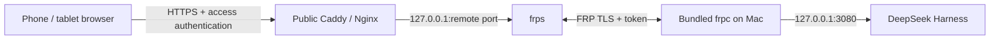

# dsh-desktop

<p align="center">
  <a href="README.md">简体中文</a> · <strong>English</strong>
</p>

<p align="center">
  
</p>

<p align="center">
  A native macOS desktop wrapper for DeepSeek Harness, with runtime bootstrapping, plugin management, a desktop pet, a code sidebar, and FRP-powered remote access from phones and tablets.
</p>

<p align="center">
  <a href="https://github.com/sunkeycn/dsh-desktop/releases/latest">Download</a>
  ·
  <a href="#mobile-remote-access">Mobile remote access</a>
  ·
  <a href="#building-from-source">Build from source</a>
  ·
  <a href="#security">Security</a>
</p>


## Features

- Native macOS window built with AppKit and WKWebView, with standard window controls and an immersive transparent title bar.
- Automatic runtime setup: downloads Node.js and `@deepseek-ai/dsh` on first launch and checks for Harness updates from the app.
- Native plugin manager for viewing versions, updating, enabling, disabling, and removing plugins, with a single restart after multiple changes.
- Built-in code sidebar powered by the open-source [`dsh-better-sidebar`](https://github.com/omdsh-dev/DSH-better-sidebar).
- Built-in desktop pet powered by [`dsh-pet`](https://github.com/PC2005-cloud/dsh-pet), with VP9-alpha WebM for Chromium and HEVC-alpha MOV for transparent playback in WKWebView.
- Built-in FRP client: bundles `frpc 0.71.0` and a configuration plugin, allowing the local DSH instance to be exposed through your own `frps` server and accessed from phones, tablets, and other browsers.
- Local-first credential handling: the FRP token is stored in macOS Keychain and is never returned to the web client.

## Screenshots

### Plugin manager


### Remote access


### Harness updates


### Startup status


> Plugin versions shown in the screenshots may be newer than the bundled versions because plugins can be updated independently.

## Installation

1. Download the DMG for your Mac architecture from [Releases](https://github.com/sunkeycn/dsh-desktop/releases/latest).
2. Open the DMG and drag `DeepSeek Harness.app` into Applications.
3. Launch the app and wait for it to prepare Node.js, Harness, and the bundled plugins.

Current DMG releases use ad-hoc signing and are not notarized with an Apple Developer ID. If macOS blocks the first launch, approve it under System Settings > Privacy & Security, or build the app from source.

### Requirements

- macOS 12.0 or later
- Network access to npm, GitHub Releases, and the Node.js download service
- Check each Release for its build architecture; a single-architecture build is never labeled Universal

## Bundled plugins

| Plugin | Bundled version | Purpose | Source |
| --- | --- | --- | --- |
| `dsh-pet` | `0.1.8` | Desktop pet | [PC2005-cloud/dsh-pet](https://github.com/PC2005-cloud/dsh-pet) |
| `dsh-better-sidebar` | `0.15.2` | Code and workspace sidebar | [omdsh-dev/DSH-better-sidebar](https://github.com/omdsh-dev/DSH-better-sidebar) |
| `dsh-frp-remote` | `0.2.0` | FRP configuration and tunnel management | This repository |

Bundled versions are used only for first-time installation and repair. After installation, use DeepSeek Harness > Plugin Manager to check for plugin updates independently.

## FRP remote access

dsh-desktop bundles `frpc 0.71.0` and the `dsh-frp-remote` plugin, so no separate FRP client installation is required on the Mac. It forwards the DSH web service fixed at `127.0.0.1:3080` to your own public server through an encrypted FRP tunnel.



### What is built in

- `frpc 0.71.0`, installed into the app runtime and started or restarted by the plugin.
- A graphical Remote Access settings page for the server, TLS, token, proxy name, remote port, and public HTTPS URL.
- A fixed local target: only `127.0.0.1:3080` can be forwarded, and the web UI cannot change it to another local service.
- Credential protection: the FRP token is kept in macOS Keychain, is not written to TOML, and is never returned to the web client.
- Local-only administration: the configuration API listens only on `127.0.0.1:3081`; writes also require a trusted Origin and a CSRF token. Remote devices cannot change the FRP configuration.
- Trusted Host integration: the app reads the public HTTPS URL and adds its authority to Harness through `--trusted-host` on startup.

### What you need to provide

- A server with a public IP address running [`frps`](https://github.com/fatedier/frp).
- A domain pointing to that server and an HTTPS reverse proxy such as Caddy or Nginx.
- Public access authentication, such as Basic Auth, an OAuth/OIDC gateway, or a VPN. FRP does not provide web login protection.

## Mobile remote access

The example below uses `frps.example.com:7000` as the FRP server, `13080` as the remote port, and `https://dsh.example.com` as the mobile URL. Replace them with your own domains and ports, and use a strong random token.

### 1. Deploy frps on the public server

Download the appropriate [frp Release](https://github.com/fatedier/frp/releases) for your server and create `frps.toml`:

```toml
bindPort = 7000

auth.method = "token"
auth.token = "replace-with-a-strong-random-token"
```

Start `frps` and allow the Mac to connect to TCP port `7000`. For production deployments, use systemd or a container runtime to restart the service automatically.

### 2. Configure HTTPS and access authentication

On the public server, reverse proxy your domain to the FRP remote port. Example Caddy configuration:

```caddyfile
dsh.example.com {
    basic_auth {
        dsh-user <HASH_FROM_CADDY_HASH_PASSWORD>
    }
    reverse_proxy 127.0.0.1:13080
}
```

Generate the password hash with `caddy hash-password`. Use a firewall to block direct public access to port `13080`; otherwise, a visitor could bypass HTTPS and authentication and connect directly to DSH.

### 3. Configure the tunnel on the Mac

Open DeepSeek Harness and fill in Settings > Remote Access:

| Setting | Example |
| --- | --- |
| Enable tunnel | On |
| Server address | `frps.example.com` |
| Server port | `7000` |
| TLS | On |
| Authentication | Token |
| Token | The same value used in `frps.toml` |
| Proxy name | `dsh-web` |
| Local service | `127.0.0.1:3080` (fixed and read-only) |
| Remote port | `13080` |
| Public HTTPS URL | `https://dsh.example.com` |

Select Test Connection to verify that the FRP server is reachable, then select Save and Restart Tunnel. If you change the public HTTPS URL, restart Harness as well so the new Trusted Host takes effect.

### 4. Connect from a phone or tablet

Keep the Mac awake with Harness running and the tunnel status showing Connected. Open `https://dsh.example.com` in Safari, Chrome, or another modern browser on iPhone, iPad, or Android, then complete the access authentication to use the DSH instance running on your Mac.

Mobile devices do not need an FRP client. Remote access remains available only while the Mac, public server, and their network connections are online.

### Configuration fields

The Remote Access settings page supports:

- FRP server address and port
- TLS
- Token authentication
- Proxy name and remote port
- Public HTTPS URL

The local service is fixed at `127.0.0.1:3080`. Configuration files are stored under `~/.dsh/frp`, while the token is stored in macOS Keychain. The local configuration API listens only on `127.0.0.1:3081`, and write requests require both a trusted Origin and a CSRF token.

## Security

- FRP provides a network tunnel, not public HTTPS, login authentication, or access control.
- Before exposing DSH to the internet, configure HTTPS and reliable access authentication at the public entry point.
- Restrict the FRP remote port with a firewall so it cannot bypass the reverse proxy's HTTPS and authentication.
- Use a strong random FRP token, and keep `frps`, the reverse proxy, and dsh-desktop up to date.
- Never commit FRP tokens, private keys, cookies, or other credentials to the repository, issues, or logs.
- Remote pages can read only redacted tunnel status and cannot read or modify the token stored on the Mac.
- Plugins run inside the local Harness process. Install only plugins and versions you trust.

## Building from source

### Dependencies

- macOS 12+
- Xcode Command Line Tools, including Swift, codesign, and iconutil
- Node.js and npm
- `ffmpeg` for generating HEVC-alpha pet assets

### Commands

```bash
./build.sh
./build.sh --install
./build.sh --dmg
./build.sh --version 1.0.0 --install --dmg
```

The build script:

1. Compiles the Swift app.
2. Downloads plugin versions pinned by the catalog from npm.
3. Generates HEVC-alpha MOV files for WKWebView pet animation playback.
4. Downloads `frpc 0.71.0` for the current architecture from the frp Release and verifies its SHA-256 checksum.
5. Ad-hoc signs the app and optionally installs it or creates a DMG.

Set a custom ffmpeg path with:

```bash
FFMPEG_BIN=/path/to/ffmpeg ./build.sh --dmg
```

## Tests

```bash
swiftc -swift-version 5 -typecheck \
  -framework Cocoa -framework WebKit \
  main.swift PluginManager.swift

node --test tests/frp-config.test.mjs
```

## Project structure

```text
.
├── main.swift                 # App lifecycle, WKWebView, bootstrap, and menus
├── PluginManager.swift        # Native plugin manager
├── plugin-catalog.json        # Bundled plugin catalog
├── plugins/
│   ├── dsh-frp-remote/        # FRP host plugin and web settings
│   └── dsh-pet/               # HEVC-alpha conversion and patches
├── scripts/                   # Profile migration and seed cleanup
├── tests/                     # FRP configuration tests
├── icon/                      # App icon assets
└── build.sh                   # App and DMG build script
```

## Data directories

- App runtime: `~/Library/Application Support/DeepSeek Harness`
- DSH profile: `~/.dsh/profiles/web`
- FRP configuration: `~/.dsh/frp`
- Launcher log: `~/.dsh/launcher.log`

Closing the desktop window does not stop a Harness server previously started with `nohup`.

## Third-party projects

- [DeepSeek Harness](https://github.com/deepseek-ai/deepseek-harness): MIT
- [dsh-pet](https://github.com/PC2005-cloud/dsh-pet): MIT
- [DSH-better-sidebar](https://github.com/omdsh-dev/DSH-better-sidebar): MIT
- [frp](https://github.com/fatedier/frp): Apache-2.0

Third-party projects, plugins, and media remain subject to their respective licenses and copyright notices. This project is not affiliated with or endorsed by DeepSeek.
See [THIRD_PARTY_NOTICES.md](THIRD_PARTY_NOTICES.md) for details.

## License

[MIT](LICENSE)
